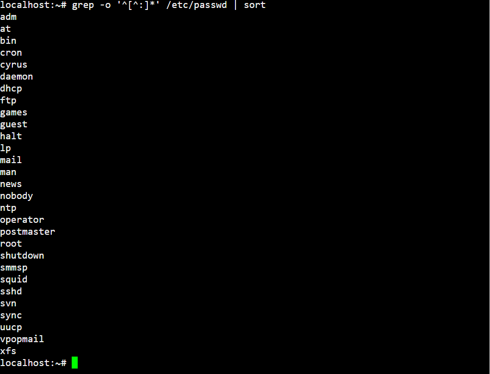
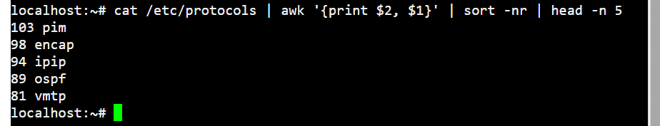
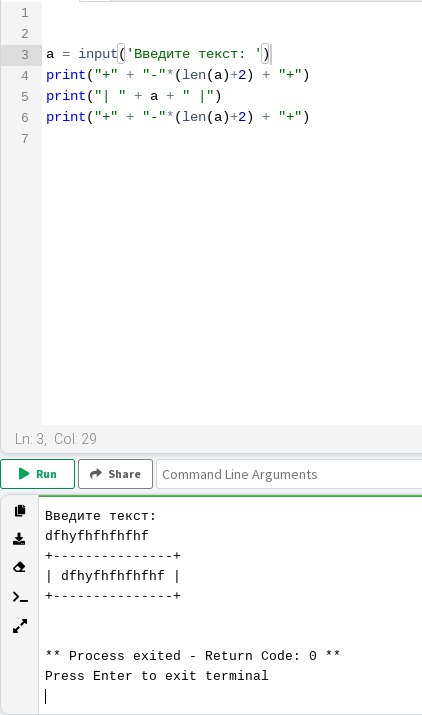
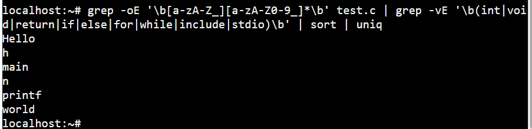

## Задача номер 1


Вывести отсортированный в алфавитном порядке список имен пользователей в файле passwd (вам понадобится grep).

Решение:
```bash
grep -o '^[^:]*' /etc/passwd | sort
```




## Задача номер 2

Вывести данные /etc/protocols в отформатированном и отсортированном порядке для 5 наибольших портов, как показано в примере ниже:

```
[root@localhost etc]# cat /etc/protocols ...
142 rohc
141 wesp
140 shim6
139 hip
138 manet
```

Решение:
```bash
cat /etc/protocols | awk '{print $2, $1}' | sort -nr | head -n 5
```




## Задача номер 3

Написать программу banner средствами bash для вывода текстов, как в следующем примере (размер баннера должен меняться!):

```
[root@localhost ~]# ./banner "Hello from RTU MIREA!"
+-----------------------+
| Hello from RTU MIREA! |
+-----------------------+
```

Перед отправкой решения проверьте его в ShellCheck на предупреждения.

Решение:
```a = input('Введите текст: ')
print("+" + "-"*(len(a)+2) + "+")
print("| " + a + " |")
print("+" + "-"*(len(a)+2) + "+")
```



## Задача номер 4

Написать программу для вывода всех идентификаторов (по правилам C/C++ или Java) в файле (без повторений).

Пример для hello.c:

```
h hello include int main n printf return stdio void world
```

Решение:
```bash
grep -o '\b[_A-Za-z][_A-Za-z0-9]*\b' hello.cpp | sort | uniq
```



## Задача номер 5

Написать программу для регистрации пользовательской команды (правильные права доступа и копирование в /usr/local/bin).

Например, пусть программа называется reg:

```
./reg banner
```

В результате для banner задаются правильные права доступа и сам banner копируется в /usr/local/bin.

Решение:
```

```


## Задача номер 6

Написать программу для проверки наличия комментария в первой строке файлов с расширением c, js и py.

Решение:
```

```


## Задача номер 7

Написать программу для нахождения файлов-дубликатов (имеющих 1 или более копий содержимого) по заданному пути (и подкаталогам).

Решение: 
```

```


## Задача номер 8

Написать программу, которая находит все файлы в данном каталоге с расширением, указанным в качестве аргумента и архивирует все эти файлы в архив tar.

Решение: 
```

```


## Задача номер 9

Написать программу, которая заменяет в файле последовательности из 4 пробелов на символ табуляции. Входной и выходной файлы задаются аргументами.

Решение:
```

```


## Задача номер 10

Написать программу, которая выводит названия всех пустых текстовых файлов в указанной директории. Директория передается в программу параметром. 

Решение:
```
```
