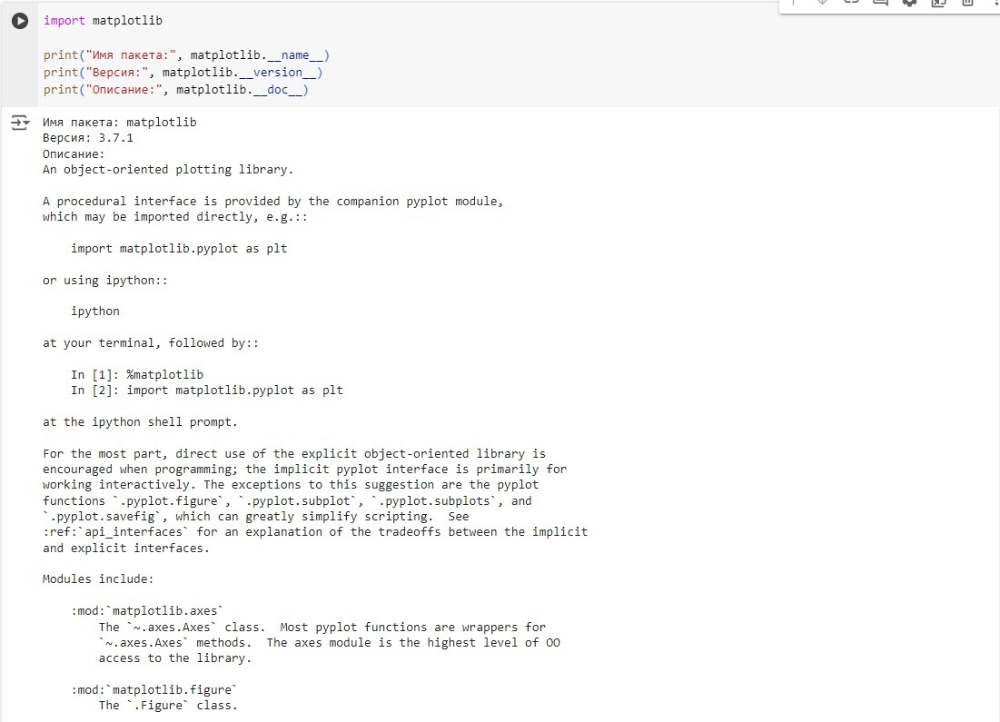

## Задача номер 1

Вывести служебную информацию о пакете matplotlib (Python). Разобрать основные элементы содержимого файла со служебной информацией из пакета. Как получить пакет без менеджера пакетов, прямо из репозитория?


Решение:
```import matplotlib

print("Имя пакета:", matplotlib.__name__)
print("Версия:", matplotlib.__version__)
print("Описание:", matplotlib.__doc__)
```



